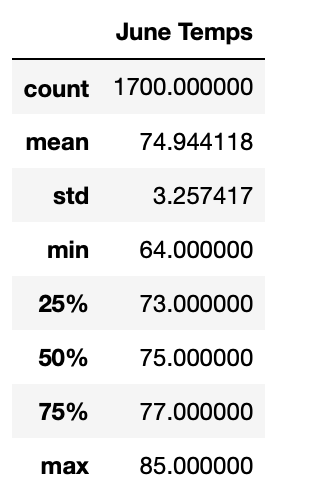
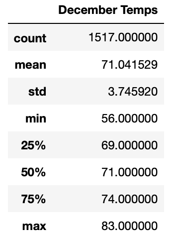

# surfs_up

## Overview.

The purpose of this project is to analyze the weather in Oahu to determine if a surf shop is a sustainable business year-round. 

To do this we are retrieving the weather data from 2 months, June and December, and comparing the statistics. This will help us see if the shop can stay open and profitable all year.

## Results.

After analyzing the data, we can see that:

- The average temperature in June is 74.9 while the average temperature in December is 71.04, which means that the temperature change from June to December is not that big.

- The maximum temperature in June is 85, and the maximum temperature in December is 83, confirming that the temperature change is not that significant.

- However, the minimum temperature reach in December is 56, this could represent a problem for the shop.

## Summary.

After our analysis, we can see that the temperature doesn't change that much between June and December, which is good news.

The only problem we can see is the minimum temperature in December. To stay on top of this, we should do a new query to find out how many days the temperature drops between 65 and 56 degrees. This way we can know how many days the shop will have to stay close.

We should also do another query to analyze the precipitation in June and December because warm weather doesn't always mean dry weather. So we should have the analysis for that too.